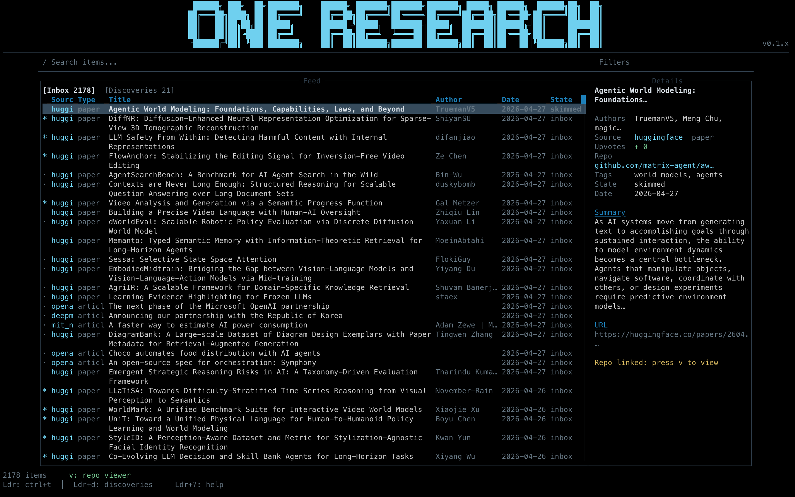

# trench

A terminal UI for following AI research — aggregates arXiv, HuggingFace daily papers, and blog feeds into a single keyboard-driven interface.



## Features

- Aggregates arXiv (cs.LG, cs.AI, stat.ML and more), HuggingFace daily papers, OpenAI blog, DeepMind blog, BAIR blog, MIT News AI, Import AI newsletter, and any custom RSS/Atom feed
- Workflow states per item: Inbox, Skimmed, Queued, Deep Read, Archived — persisted across sessions
- Full-text reader: opens papers and articles inline without leaving the TUI
- Split-view reader: primary feed alongside a persistent reader pane, independently scrollable
- Floating reader popup: open a paper in a centered overlay without leaving the feed
- GitHub repository browser: browse and read linked repos from the details panel
- Notes panel: per-session markdown notes alongside any pane
- Chat panel: ask questions about the selected item using Claude or OpenAI
- AI source discovery: describe a topic and trench finds relevant arXiv categories and RSS feeds to add
- Semantic Scholar enrichment: citation counts and fields of study (7-day cache)
- Runtime themes: Dark, Light, and AMOLED — switchable from the Settings screen
- Fast startup: cached feed loaded immediately; network fetches run in the background
- No async runtime — plain threads and blocking I/O throughout

## Installation

### From source

Requires Rust 1.88 or later.

```sh
git clone https://github.com/VictoryChianumba/trench
cd trench
cargo build -p trench --release
# Binary is at target/release/trench
```

To install into `~/.cargo/bin`:

```sh
cargo install --path trench
```

### Requirements

- Rust 1.88+
- Optional: Claude API key (`claude_api_key` in config) for AI chat and source discovery
- Optional: OpenAI API key (`openai_api_key` in config) for AI chat with GPT models
- Optional: GitHub token (`github_token` in config) for the repository browser
- Optional: Semantic Scholar API key (`semantic_scholar_key` in config) for citation enrichment

## Configuration

Config file: `~/.config/trench/config.json`

The file is created automatically on first run. All fields are optional.

```json
{
  "github_token": "ghp_...",
  "semantic_scholar_key": "...",
  "claude_api_key": "sk-ant-...",
  "openai_api_key": "sk-...",
  "default_chat_provider": "claude",
  "sources": {
    "arxiv_categories": ["cs.LG", "cs.AI", "stat.ML"],
    "enabled_sources": {
      "huggingface": true,
      "openai": true,
      "deepmind": true,
      "import_ai": true,
      "bair": true,
      "mit_news_ai": true
    },
    "custom_feeds": []
  }
}
```

| Field | Description |
|---|---|
| `github_token` | Personal access token for the GitHub repository browser |
| `semantic_scholar_key` | API key for citation enrichment (unauthenticated requests are rate-limited) |
| `claude_api_key` | Anthropic API key for Claude chat and AI source discovery |
| `openai_api_key` | OpenAI API key for GPT chat |
| `default_chat_provider` | `"claude"` or `"openai"` |
| `sources.arxiv_categories` | arXiv category codes to fetch (e.g. `"cs.CL"`, `"cs.CV"`) |
| `sources.enabled_sources` | Toggle predefined sources on or off |
| `sources.custom_feeds` | List of custom RSS/Atom feeds (see Sources below) |

Settings can also be edited from within the TUI via `Ldr+S` (Settings screen), including theme selection.

Runtime data files:

| Path | Contents |
|---|---|
| `~/.config/trench/config.json` | Configuration |
| `~/.config/trench/state.json` | Persisted workflow states (keyed by URL) |
| `~/.config/trench/cache.json` | Last fetched feed items |
| `~/.config/trench/enrichment_cache.json` | Semantic Scholar data (7-day TTL) |
| `~/.config/trench/trench.log` | Log file (set `TRENCH_DEBUG_LOG=1` for verbose output) |

## Sources

### Default sources

| Source | Type |
|---|---|
| arXiv | Atom API — cs.LG, cs.AI, stat.ML (configurable) |
| HuggingFace daily papers | Scraped; upvote counts included |
| OpenAI blog | RSS |
| DeepMind blog | RSS |
| BAIR blog | RSS |
| MIT News AI | RSS |
| Import AI | Substack RSS |

### Adding sources

**arXiv categories** — open Settings (`Ldr+S`), navigate to Sources, and add any arXiv category code (e.g. `cs.CL`, `cs.CV`, `cs.NE`, `cs.RO`, `stat.ML`).

**AI source discovery** — switch to the Discoveries tab (`Ldr+d`), press `/`, and describe a research topic. trench will query the model and return a list of relevant arXiv categories and RSS feeds you can add with a single keystroke.

**Custom RSS/Atom feeds** — go to Settings (`Ldr+S`) → Sources → Add feed. Paste the URL; trench will auto-detect whether it is an arXiv category, a Substack blog, or a generic RSS/Atom feed. Custom feeds are stored in `config.json` under `sources.custom_feeds`.

To add a feed manually, append an entry to `custom_feeds`:

```json
{
  "url": "https://example.com/feed.xml",
  "name": "example",
  "feed_type": "rss"
}
```

## Keybindings

The leader key is `Ctrl+T` (shown as `Ldr` below).

### Feed navigation

| Key | Action |
|---|---|
| `j` / `k` | Move down / up |
| `g` / `G` | Jump to top / bottom |
| `/` | Search / filter feed |
| `Enter` | Open item in reader |
| `o` | Open URL in browser |
| `r` | Refresh all sources |
| `Tab` | Cycle focus between open panes |

### Workflow states

| Key | State |
|---|---|
| `i` | Inbox |
| `s` | Skimmed |
| `q` | Queued |
| `w` | Deep Read |
| `x` | Archived |

### Leader bindings (`Ctrl+T` then key)

| Binding | Action |
|---|---|
| `Ldr+d` | Toggle between Inbox and Discoveries tabs |
| `Ldr+v` | Toggle split-view secondary reader pane |
| `Ldr+Enter` | Open selected item in floating popup reader |
| `Ldr+c` | Toggle Chat pane |
| `Ldr+n` | Toggle Notes pane |
| `Ldr+S` | Open Settings screen |
| `Ldr+?` | Open help screen |
| `Ldr+q` | Quit |

### Reader mode

| Key | Action |
|---|---|
| `j` / `k` | Scroll down / up one line |
| `d` / `u` | Scroll down / up half page |
| `f` / `b` | Scroll down / up full page |
| `g` / `G` | Jump to top / bottom |
| `q` / `Esc` | Close reader |

### Split-view states

| State | Layout |
|---|---|
| State 1 | Feed list + details panel |
| State 2 | Feed 40% + reader 60% |
| State 3 | Reader 50% + secondary reader 50% |

`Tab` cycles focus between open panes. `Ldr+v` opens or closes the secondary reader pane (State 3 only). `Esc` from any reader returns to the feed.

## Known limitations

- **Semantic Scholar rate limiting** — unauthenticated requests hit the free-tier cap quickly for large feeds. Apply for an API key at semanticscholar.org and set `semantic_scholar_key` in config.
- **AI source discovery requires a Claude API key** — the Discoveries tab query feature calls the Anthropic API; it is a no-op without a key.
- **Voice/TTS** — ElevenLabs-based voice reading is implemented but currently disabled pending API credits. macOS `say` and Piper are wired in as fallback providers.
- **No Windows support** — uses crossterm and Unix path conventions; untested on Windows.
- **Anthropic has no RSS feed** — intentionally excluded; their blog is not machine-readable.

## Roadmap

- [ ] Floating reader popup — open paper in overlay without leaving feed (`Ldr+Enter`)
- [ ] Pane navigation with `Ldr+hjkl` spatial movement between all panes
- [ ] Voice mode — fix ElevenLabs wiring and add word-highlight animation
- [ ] Help screen — full keybinding reference accessible via `Ldr+?`
- [ ] Leader key footer — always show `Ldr: Ctrl+T` and available bindings
- [ ] Notes accessible from reader mode via `Ldr+n`
- [ ] README hero screenshot and demo GIF

## Contributing

Issues and pull requests are welcome. The codebase is intentionally minimal — no async, no macros beyond what Rust requires, no framework beyond ratatui. Read `CLAUDE.md` for architecture notes before contributing.

```sh
cargo build -p trench --release   # build
cargo test -p trench               # test
cargo clippy -p trench             # lint
cargo fmt --check                  # format check
```

## License

trench is released under the [GNU Affero General Public License v3.0](LICENSE).
